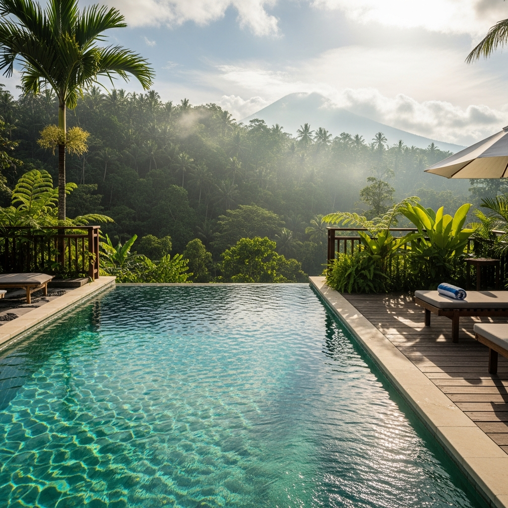

# EcoPool Bali - Professional Pool Service Website



## 🏊 About

EcoPool Bali is a professional pool service company operating in Bali, Indonesia since 2010. This repository contains the complete responsive website showcasing our comprehensive pool services including maintenance, cleaning, repair, and installation.

## 🌟 Features

- **Fully Responsive Design**: Optimized for desktop, tablet, and mobile devices
- **SEO Optimized**: Complete meta tags, schema markup, sitemap, and robots.txt
- **Comprehensive Services**: Detailed pages for all pool service offerings
- **Mobile-First**: Touch-friendly navigation with hamburger menu
- **Accessibility**: ARIA labels and semantic HTML throughout
- **FAQ Sections**: Interactive accordion-style FAQs on all service pages
- **WhatsApp Integration**: Direct contact via WhatsApp at +62 823-2301-1656
- **Eco-Friendly Focus**: Emphasis on sustainable pool care practices

## 📋 Website Structure

```
website/
├── index.html              # Home page with company overview
├── pages/
│   ├── about.html          # Company history and team
│   ├── services.html       # Complete service offerings
│   ├── pool-maintenance.html  # Weekly/bi-weekly maintenance
│   ├── pool-repair.html    # Equipment and structural repairs
│   ├── pool-installation.html # Custom pool construction
│   ├── contact.html        # Contact information and inquiry form
│   └── blog.html           # Pool care tips and advice
├── css/
│   └── styles.css          # Complete responsive stylesheet
├── js/
│   └── main.js             # Mobile menu and interactive elements
├── images/                 # Pool service images
├── sitemap.xml             # SEO sitemap
└── robots.txt              # Search engine directives
```

## 🚀 Getting Started

### Prerequisites

- Node.js 20+ (for development build tools)
- Modern web browser
- Basic web server (for local development)

### Local Development

1. Clone the repository:
```bash
git clone https://github.com/ddandanell/pool-pool-network-1.git
cd pool-pool-network-1
```

2. Install dependencies:
```bash
npm install
```

3. Run development server:
```bash
npm run dev:client
```

4. Open `http://localhost:5000` in your browser

### Production Build

```bash
npm run build
npm start
```

## 🌐 Deployment

### Vercel Deployment

This website is optimized for deployment on Vercel:

1. Connect your GitHub repository to Vercel
2. Configure build settings (auto-detected)
3. Deploy to production

The website is static HTML/CSS/JS and requires no special configuration for Vercel deployment.

### Environment Variables

No environment variables required for the static website portion.

## 📱 Contact Integration

All contact points use:
- **WhatsApp**: +62 823-2301-1656  
- **Email**: info@balipoolservice.com
- **Office**: Jl. Raya Ubud No. 45, Gianyar, Bali 80571, Indonesia

## 🎨 Design & SEO

- **Color Scheme**: Tropical aqua blues (#0891b2, #06b6d4, #22d3ee)
- **Typography**: Segoe UI, system fonts for fast loading
- **Images**: Optimized PNGs, lazy loading enabled
- **Meta Tags**: Unique titles and descriptions per page
- **Schema Markup**: LocalBusiness JSON-LD on all pages
- **Keywords**: Comprehensive targeting of "pool service Bali" and variations

## 🔧 Technologies

- **HTML5**: Semantic markup
- **CSS3**: Flexbox, Grid, custom properties
- **Vanilla JavaScript**: No frameworks, minimal dependencies
- **SEO**: Structured data, sitemaps, meta tags
- **Accessibility**: ARIA labels, keyboard navigation

## 📊 SEO Keywords

Primary keywords targeted throughout the site:
- pool service Bali
- pool maintenance Bali
- pool cleaning Bali
- pool repair Bali
- swimming pool installation Bali
- Bali pool experts

## 🧪 Testing

The website has been tested on:
- Chrome, Firefox, Safari, Edge (latest versions)
- iOS Safari and Android Chrome
- Various screen sizes from 320px to 4K

## 📄 License

Copyright © 2025 EcoPool Bali. All rights reserved.

## 🤝 Contributing

This is a commercial website. For inquiries, contact info@balipoolservice.com

## 📞 Support

For website issues or pool service inquiries:
- WhatsApp: +62 823-2301-1656
- Email: info@balipoolservice.com
- Hours: Mon-Sat 8:00 AM - 6:00 PM (Bali time)

---

**Built with care for Bali's pool service industry** 🏊‍♂️🌴
